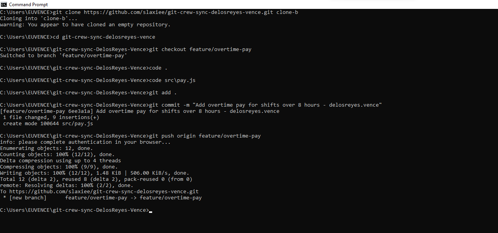
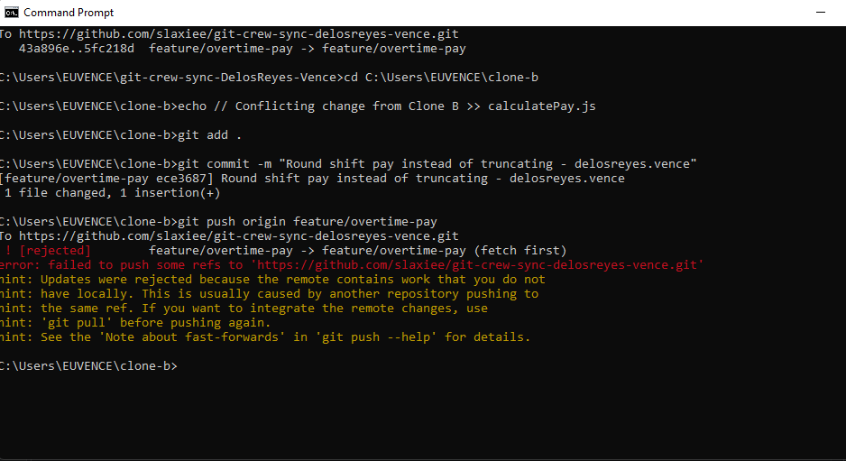
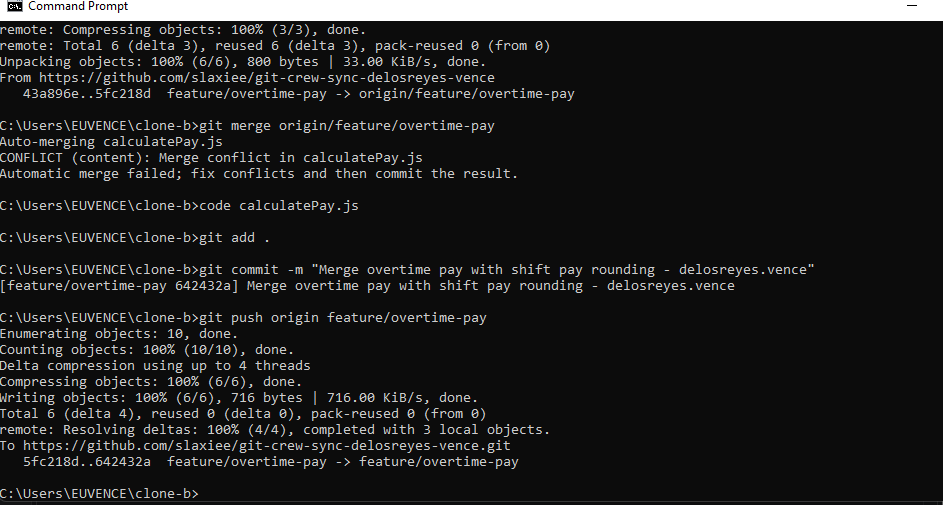
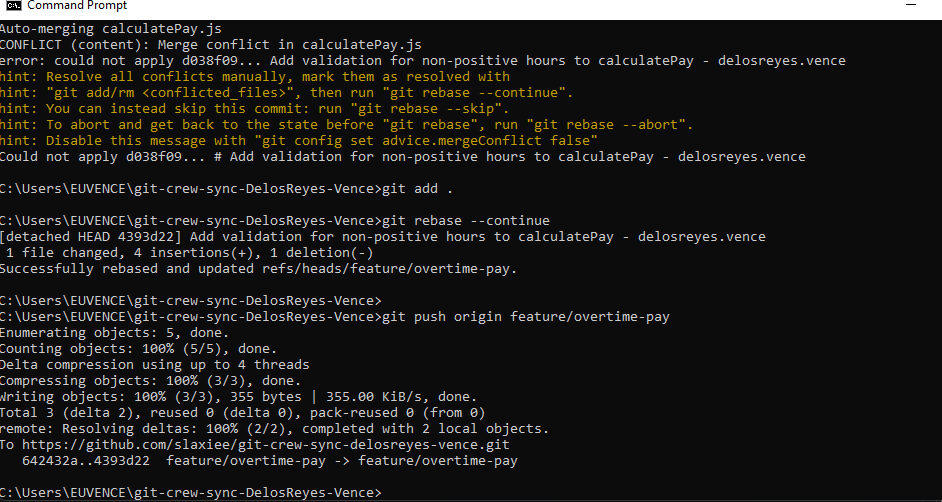

# Git Crew Sync Lab Report

**Student Name:** Vence Delos Reyes  
**Repository:** git-crew-sync-delosreyes-vence  

---

## Evidence Screenshots

### Task 1: Successful Push from Clone A

### Task 2: Rejected Push from Clone B

### Task 3: Merge Conflict Resolution & Push

### Task 4: Rebase Conflict Resolution & Clean Push

### Task 5: Merge into Main

### Task 6: Tag Created and Pushed (v1.0-synced)

---

## Technical Questions & Analysis

### 1. What did the rejected push error message tell you, and why did it happen?
The rejection output returned:
`! [rejected] feature/overtime-pay -> feature/overtime-pay (non-fast-forward)`
accompanied by a hint indicating that the remote repository contains work not present in the local copy.

This occurred because the local repository branch had diverged from the remote tracking reference. Another commit was pushed to the remote branch after the local clone branched off or last pulled. Because the push was not a fast-forward update (where the remote tip is an immediate ancestor of the incoming local commit), Git refused the push to protect existing remote commits from being overwritten.

### 2. What's the actual difference between how you resolved Task 3 (merge) vs Task 4 (rebase)?
* **Task 3 (Merge):** Preserved the true chronological divergence. Git created an explicit, non-linear merge commit with two parent commits: the local commit from Clone B and the remote tip from Clone A. The commit hashes of the original branch commits remained unchanged.
* **Task 4 (Rebase):** Rewrote commit history. Git peeled off the local unpushed commit, moved the local base pointer forward to match `origin/feature/overtime-pay`, and reapplied the local commit on top of the new head. This resulted in a brand-new commit hash and produced a strictly linear history without creating an extra merge commit.

### 3. What one habit would have avoided both rejected pushes in this lab?
Running `git pull` (or `git fetch` followed by inspecting incoming changes) immediately before beginning local edits and before attempting to commit/push. Regularly synchronizing with the remote tracking branch prevents local branches from going stale against teammate pushes.

### 4. Which approach — merge or rebase — would you default to on a shared team branch, and why?
**Merge** is the standard default on shared team branches. 

Rebasing rewrites commit hashes. If multiple teammates have already based work off commits that get rebased, their local histories will diverge, requiring complicated coordination and force-pushes (`git push --force-with-lease`). Merging retains accurate multi-developer commit histories, avoids altering published commit hashes, and ensures nobody's local history is invalidated. Rebasing is best reserved for local feature branches before integrating them into a shared branch.